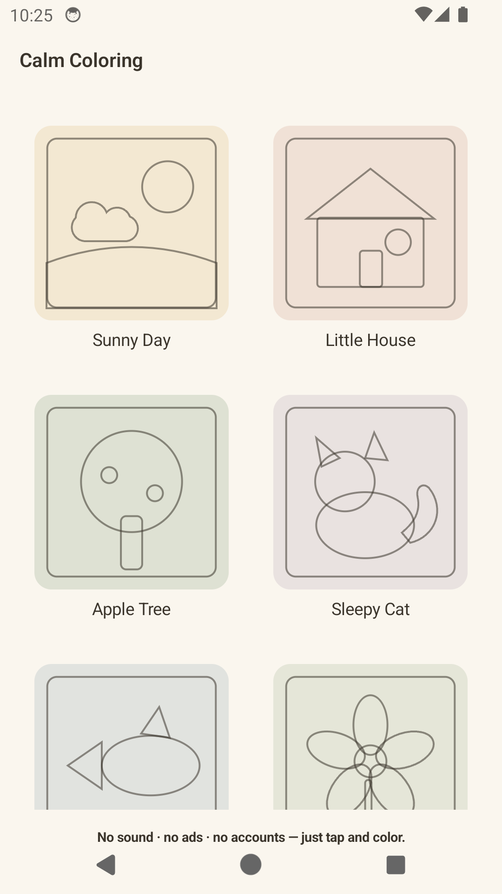
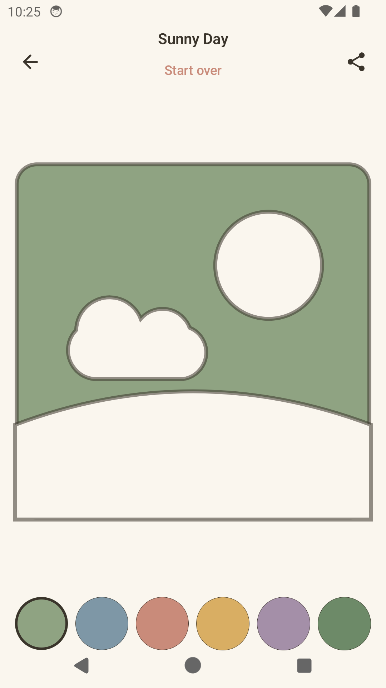

# Calm Coloring

A low-stimulation, tap-to-fill coloring app for young children (ages 3–5) — built with Kotlin Multiplatform + Compose Multiplatform for Android and iOS.

No sound. No unprompted animation. No reward loops. No ads, accounts, or data collection. Just tap a shape, watch the color settle in.

<p align="center">
  
  &nbsp;&nbsp;
  
</p>

**[▶ Try the interactive UI mockup](https://atul206.github.io/MontessoriArc/design/calm-coloring-ui-mockup.html)** — a live, click-through reference of the design system this app implements (the screenshots above are the real app, built to match it).

## Why this exists

An initial idea — an AI photo-to-coloring-page app — scored poorly against a rigorous product-viability framework: the core feature is commoditized, and uploading a child's photo is a real regulatory liability under COPPA's 2026 rules. The pivot documented in [`calm-coloring-app-PRD.md`](calm-coloring-app-PRD.md) targets a different, validated wedge instead: a genuinely calm coloring experience, in the spirit of apps like Pok Pok — low-stimulation, ad-free, privacy-first, nothing more.

## Design

- **Calm-design constraints, enforced everywhere:** no sound effects, no unprompted animation (the *only* motion is a slow, deliberate spring-settle when a region fills), no confetti/streaks/reward popups, one small muted 6-swatch palette reused for both UI chrome and fill colors.
- **Tap-to-fill vector regions**, not freehand drawing or raster flood-fill — every fillable shape is its own closed vector path, so fills never bleed and print output isn't capped by a raster template's resolution.
- **Age-tiered for 3–5 year olds** specifically — moderate region count, a real (density-computed) 2cm minimum touch target on the canvas, 6 colors shown at once, matching NN/g's own touch-target research for this age group.
- **Privacy by construction:** no accounts, no analytics SDKs, no ads. The share flow sends only the rendered picture — the artist's name typed into "Painted by {name}" is composited into the image itself and never stored or transmitted anywhere else. Outbound shares (WhatsApp / Instagram / system share sheet) sit behind a light on-device parental check; print doesn't, since it never leaves the device.

Full product rationale: [`calm-coloring-app-PRD.md`](calm-coloring-app-PRD.md). Implementation plan: [`docs/superpowers/plans/2026-09-13-calm-coloring-mvp.md`](docs/superpowers/plans/2026-09-13-calm-coloring-mvp.md).

## Features

- 11 templates (Sunny Day, Little House, Apple Tree, Sleepy Cat, Little Fish, Garden Flower, Sailboat, Balloon Ride, Cat, Funny Cat, Elephant), with new artwork publishable over the air — no app-store release needed
- Tap-to-fill with point-in-polygon hit-testing and a tuned spring fill animation
- Light and dark theme, each with its own muted palette
- Adaptive layout — portrait and landscape both purpose-built, phone and tablet
- Print export on Android, rendering the real vector paths directly onto the PDF (not a raster snapshot)
- Watermarked share to WhatsApp, Instagram, or the system share sheet, gated behind a simple on-device parental check

## OTA content pipeline

New coloring pages ship without an app-store release. The 8 launch templates stay compiled into the binary as before; everything published since is fetched, cached, and merged at runtime:

- A runtime SVG-subset parser turns `svg/*.svg` markup directly into a Compose `Path` — no compile step.
- `svg/manifest.json` (in this repo) tracks what's publishable and at what version.
- The app fetches the manifest and SVG files over HTTPS on every launch (Ktor), caches the parsed result locally (SQLDelight) so it's only downloaded once, and merges it with the 8 bundled templates — a remote id can override a bundled one.
- A bad publish rolls back cleanly: listing an id under `removedIds` purges it from every device's cache on the next launch, falling back to the original bundled version if one exists.

See [`docs/content-ota.md`](docs/content-ota.md) for the publishing/rollback workflow, and [`docs/superpowers/plans/2026-09-14-svg-ota-content-pipeline.md`](docs/superpowers/plans/2026-09-14-svg-ota-content-pipeline.md) for the implementation plan.

## Tech stack

- **Kotlin Multiplatform + Compose Multiplatform** — shared UI and logic across Android and iOS, Skia-backed rendering on both
- Hand-authored SVG → Compose `Path` content pipeline for the 8 launch templates (`composeApp/src/commonMain/.../content/generated/`), plus a runtime SVG parser for OTA content (`.../content/remote/`)
- Ktor (HTTPS fetch) + SQLDelight (local cache) + kotlinx.serialization (manifest) for the OTA pipeline
- Pure-Kotlin ray-casting point-in-polygon hit-testing — no platform-specific point-in-path API, fully portable
- `androidx.lifecycle.ViewModel` (KMP artifact), a small hand-rolled navigation back stack (no navigation library — see the plan for why)
- Platform-native PDF (`android.graphics.pdf.PdfDocument` / iOS `UIGraphicsPDFRenderer`) and platform share intents (`expect`/`actual`)

## Project structure

```
calm-coloring-app-PRD.md          Product requirements
design/calm-coloring-ui-mockup.html   Interactive UI mockup (the design reference)
docs/superpowers/plans/           Implementation plans
docs/content-ota.md               OTA publishing/rollback workflow
svg/                              Hand-authored source templates + manifest.json (OTA catalog)
composeApp/src/
  commonMain/                     Shared UI, state, content pipeline (bundled + OTA/remote), navigation
  androidMain/ · iosMain/         Platform-native print, share, back-gesture handling, and OTA platform drivers (HTTP client, SQLite)
  commonTest/ · androidUnitTest/  Unit tests
iosApp/                           iOS Xcode project wrapper
```

## Building

```bash
./gradlew :composeApp:assembleDebug      # Android debug APK
./gradlew :composeApp:testDebugUnitTest  # unit tests
```

iOS: open `iosApp/` in Xcode (see [`iosApp/README.md`](iosApp/README.md) if the project needs regenerating).

## Status

v1 MVP plus the OTA content pipeline — Android-verified (built, tested, and manually verified on real devices and emulators, including a fresh install with the OTA cache schema). iOS compiles for all targets but has not yet been linked or run on a machine with Xcode.
